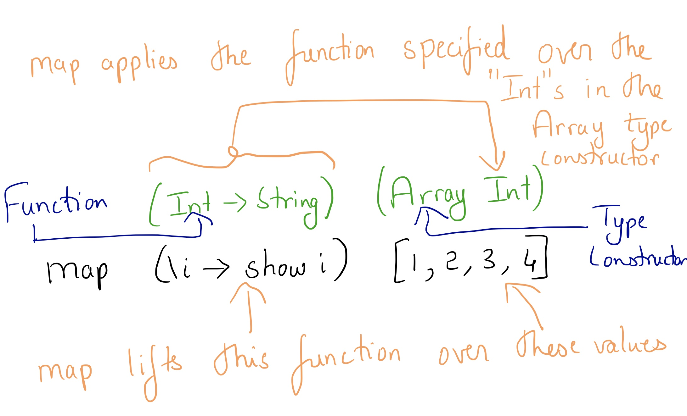
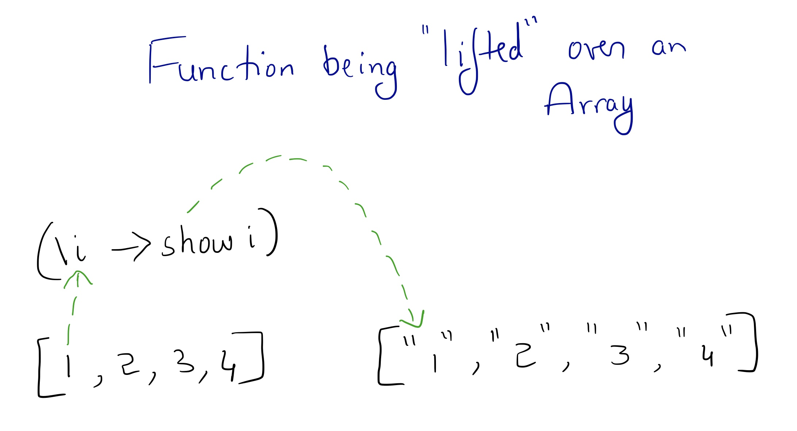

## Functors, Applicatives and Monads

The approach we will take is learning each of these by looking at their type class definitions.

### Before getting started - have a look at MiniAdventure "PureImpure"

### Functors

```
class Functor f where
  map :: forall a b. (a -> b) -> f a -> f b
```
Functors basically transform something of type "f a" to "f b". They convert "a" to "b" by using the function passed as the first parameter.

Each type "f" defines how mapping is done from "f a" to "f b" by defining a Functor instance. For example, Arrays define that mapping over Array of type a to Array of type b means that every element in the array is mapped from type a to b and the new Array of type b is returned.


<$> is an alias for map function.

Example
```
map (\i -> (show i)) [1,2,3]
```
is the same as
```
(\i -> (show i)) <$> [1,2,3]
```

Case Study - Functor instance of Maybe type
```
instance functorMaybe :: Functor Maybe where
  map fn (Just x) = Just (fn x)
  map _  _        = Nothing
```

### "Lifting" a function over values

"Lifting" a function over a type constructor just means applying the function to the type contained within the type constructor.





### Applicatives

```
class Functor f <= Apply f where
  apply :: forall a b. f (a -> b) -> f a -> f b

class Apply f <= Applicative f where
  pure :: forall a. a -> f a
```
Let's have a look at the "apply" function.
* Apply type class is a subclass of Functor. Hence, all "Apply f" needs to have "Functor f" instances as well.
* apply is ALMOST exactly similar to map. Except that it takes "f (a -> b)" instead of "(a -> b)". The function itself will be wrapped in the Type Constructor "f".

What's the advantage of having "f (a -> b)" rather than just "(a -> b)"?
*
