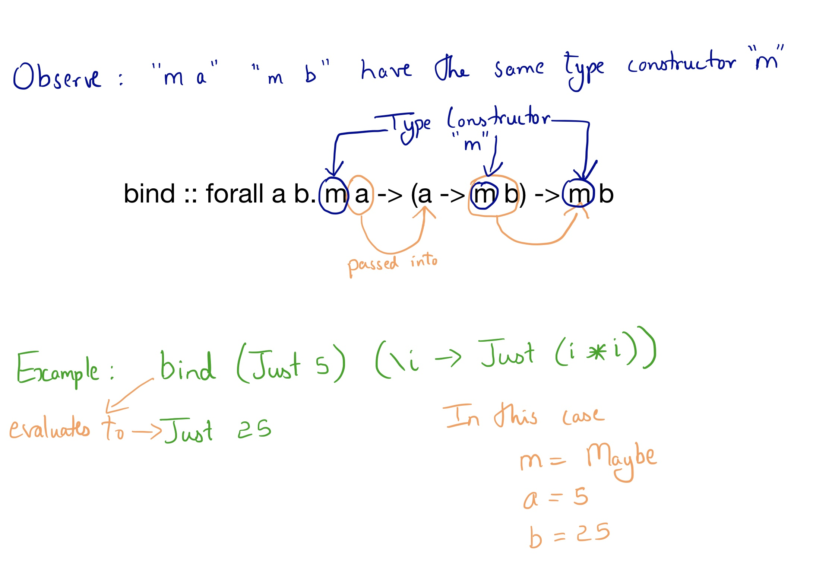
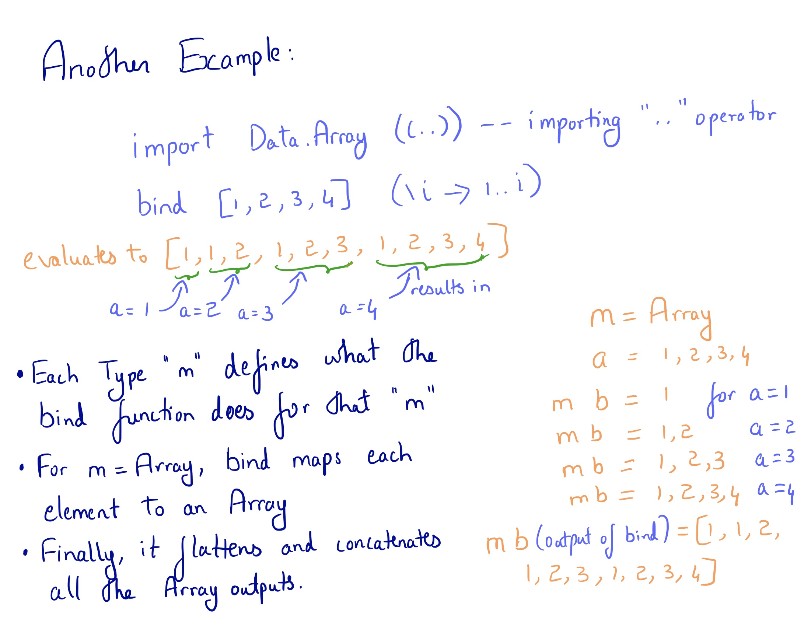

## Functors, Applicatives and Monads

The approach we will take is learning each of these by looking at their type class definitions.

### Before getting started - have a look at MiniAdventure "PureImpure"

### Functors

```
class Functor f where
  map :: forall a b. (a -> b) -> f a -> f b
```
Functors basically transform something of type "f a" to "f b". They convert "a" to "b" by using the function passed as the first parameter.

Each type "f" defines how mapping is done from "f a" to "f b" by defining a Functor instance. For example, Arrays define that mapping over Array of type a to Array of type b means that every element in the array is mapped from type a to b and the new Array of type b is returned.


<$> is an alias for map function.

Example
```
map (\i -> (show i)) [1,2,3]
```
is the same as
```
(\i -> (show i)) <$> [1,2,3]
```

Case Study - Functor instance of Maybe type
```
instance functorMaybe :: Functor Maybe where
  map fn (Just x) = Just (fn x)
  map _  _        = Nothing
```

### "Lifting" a function over values

"Lifting" a function over a type constructor just means applying the function to the type contained within the type constructor.


### Applicatives

```
class Functor f <= Apply f where
  apply :: forall a b. f (a -> b) -> f a -> f b

class Apply f <= Applicative f where
  pure :: forall a. a -> f a
```
Let's have a look at the "apply" function.
* Apply type class is a subclass of Functor. Hence, all "Apply f" needs to have "Functor f" instances as well.
* apply is ALMOST exactly similar to map. Except that it takes "f (a -> b)" instead of "(a -> b)". The function itself will be wrapped in the Type Constructor "f".

What's the advantage of having "f (a -> b)" rather than just "(a -> b)"?
* Lets us lift functions containing any number of arguments over values.

Consider the following situation

#### In the case of Functors

What we have :

* A function which takes one parameter.  Ex: (\i -> show i)
* The value over which the function needs to be lifted over - "f a" where f is any type constructor.  Ex: (Array Int)

What we want :

* A type "f b" where "f" is the same type constructor as in the input. Ex: (Array String)

This is straightforward to achieve using the map function . "map (a -> b) (f a)" directly gives us what we want - (f b)

#### But what if we had to lift a function which takes three arguments?

What we have :

* A function which takes three parameters.  (a -> b -> c -> d) where d is the return type and a, b and c are the input types.
* The values over which the function needs to be lifted over - "f a", "f b", "f c" where f is any type constructor.

What we want :

* A type "f d" where "f" is the same type constructor as in the input and "d" is the return type of the function being lifted.

What if we try to use map?

map (a -> b -> c -> d) (f a)

This takes "a" out of "f a" and applies it to (a -> b -> c -> d) and gives us a "f (b -> c -> d)". A curried function inside the type constructor f. And now what?

If we want to use map again, we need a function. Not a function within a type f. We could try taking out the function from type f and then passing it into map again.

OR we could just use apply

apply is cool in that way. It doesn't care even if the function is in a type "f", it removes the function from "f" and lifts it over the remaining values

map (a -> b -> c -> d) (f a) gives  f (b -> c -> d)

apply (f (b -> c -> d)) (f b)  gives  f (c -> d)

apply (f (c -> d))  (f c)      gives  f (d)

which is what we want.

Just as <$> is an alias for "map" function. <\*> is an alias for apply function. So, if we assume that "func" is our function (a -> b -> c -> d) , we could rewrite the above code as

func <$> (f a) <\*> (f b) <\*> (f c)

As you can observe, we can lift functions with ANY NUMBER of arguments using the above technique.

#### "pure" function

```
class Apply f <= Applicative f where
  pure :: forall a. a -> f a
```

As we can see, Applicative is a subclass of Apply. For all Applicative f there needs to be an Apply f defined first.

The function "pure" just wraps whatever data is passed in inside the type "f" and returns "f dataType"


#### Case study - Maybe
```
instance applyMaybe :: Apply Maybe where
  apply (Just fn) x = fn <$> x
  apply Nothing   _ = Nothing

instance applicativeMaybe :: Applicative Maybe where
  pure = Just
```

### Monads

```
class Apply m <= Bind m where
  bind :: forall a b. m a -> (a -> m b) -> m b

class (Applicative m, Bind m) <= Monad m
```


Another Example:



\>\>= is the alias for "bind"

Example
```
bind [1,2,3,4] (\i -> 1..i)
-- is the same as
[1,2,3,4] >>= (\i -> 1..i)
```

### A series of binds

```
bind [1,2,3] (\i -> bind [1,2,3] (\j -> [i, j]))
-- evaluates to
-- [1,1,1,2,1,3,2,1,2,2,2,3,3,1,3,2,3,3]
```
Can also be written as
```
[1,2,3] >>= (\i -> [1,2,3] >>= (\j -> [i, j]))
```

Can also be written as
### do notation

```
do
  i <- [1,2,3]  -- equivalent to [1,2,3] >>= (\i -> )
  j <- [1,2,3]  -- equivalent to ( -> [1,2,3] >>= (\j -> ))
  [i, j]        -- equivalent to ( -> [i, j])
  -- the last line in a do notation always has to be an expression
  -- Since our "m", the type constructor in these binds is an Array,
  -- last expression evaluates to an Array [i, j]
```

The above expression is exactly equal to writing
```
[1,2,3] >>= (\i -> [1,2,3] >>= (\j -> [i, j]))
```

do notation is simply a convenient way of writing a lot of "bind"s together

* do notation introduces a new block. Hence, mind the indentation.
* The last line in a do block always has to be an expression

More examples of do

```
func = do
        i <- 1..5
        j <- 1..i
        k <- 1..j
        [i,j,k]
```
is the same as
```
func = 1..5 >>= (\i -> 1..i >>= (\j -> 1..j >>= (\k -> [i,j,k])))
```
### type class Monad
```
class (Applicative m, Bind m) <= Monad m
```
Simply put, type "m" is a Monad if "m" has both Applicative instance as well as a Bind instance.
