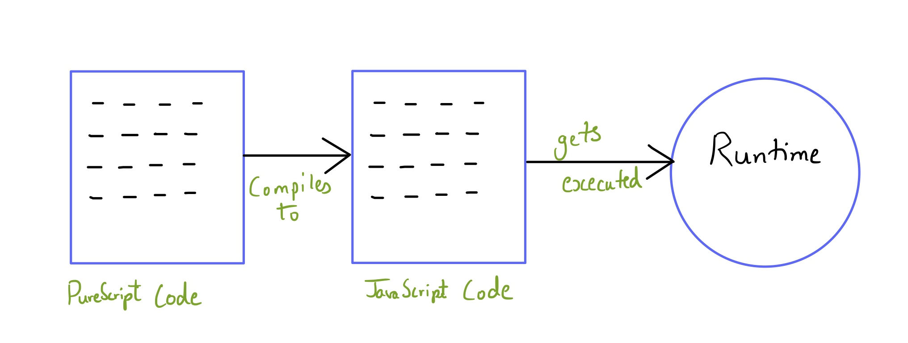
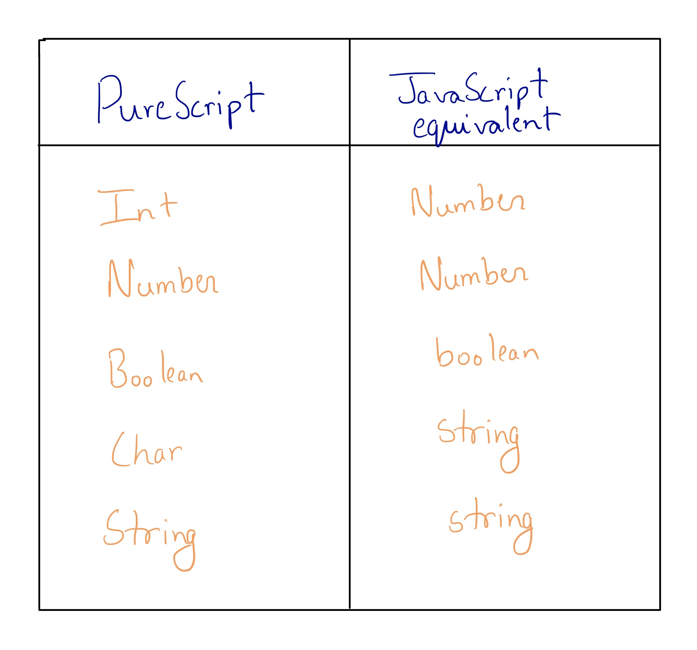
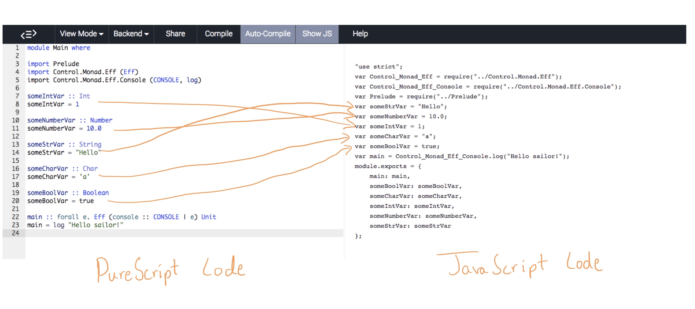
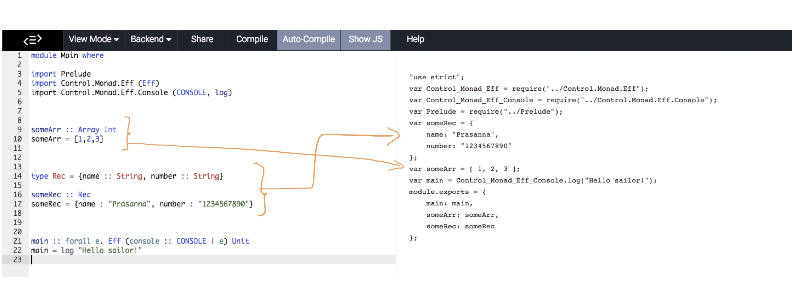
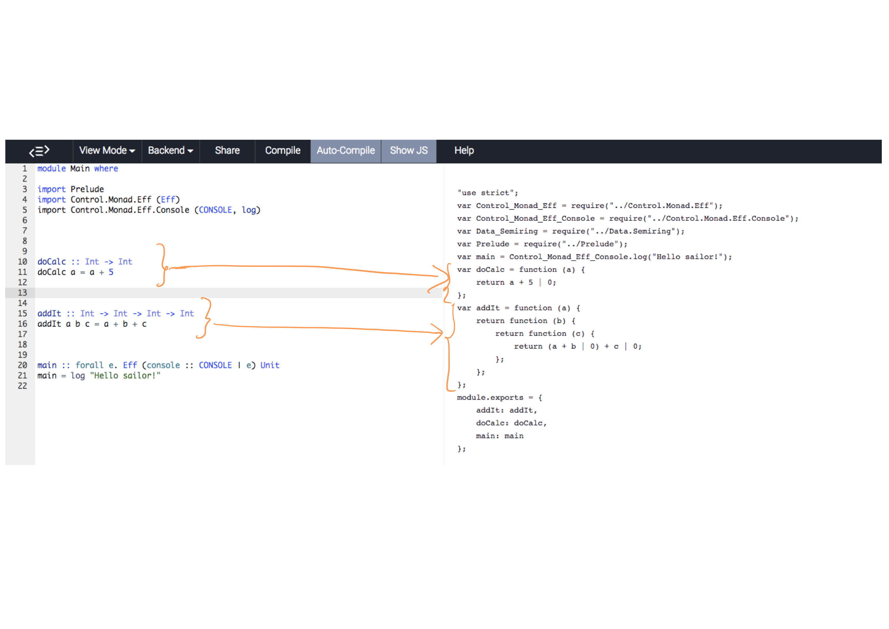
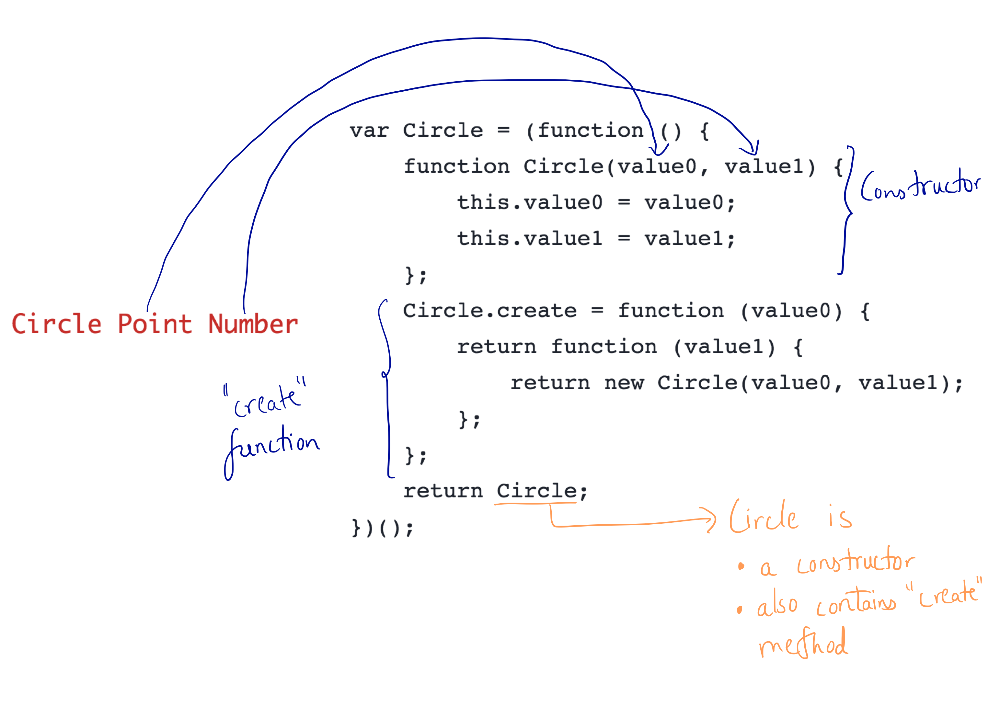
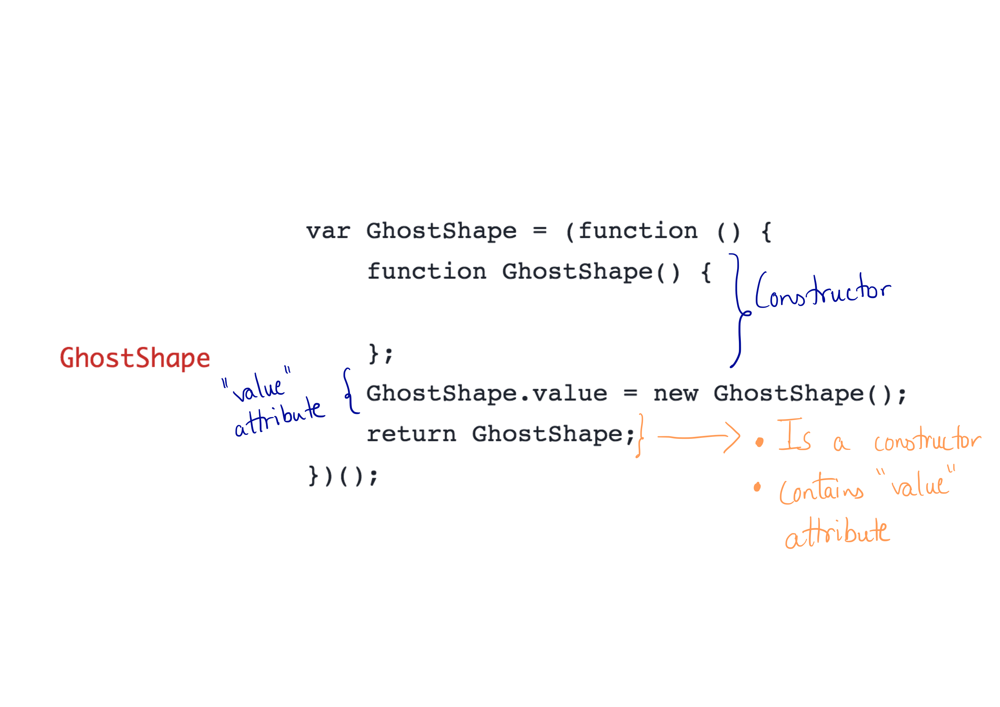
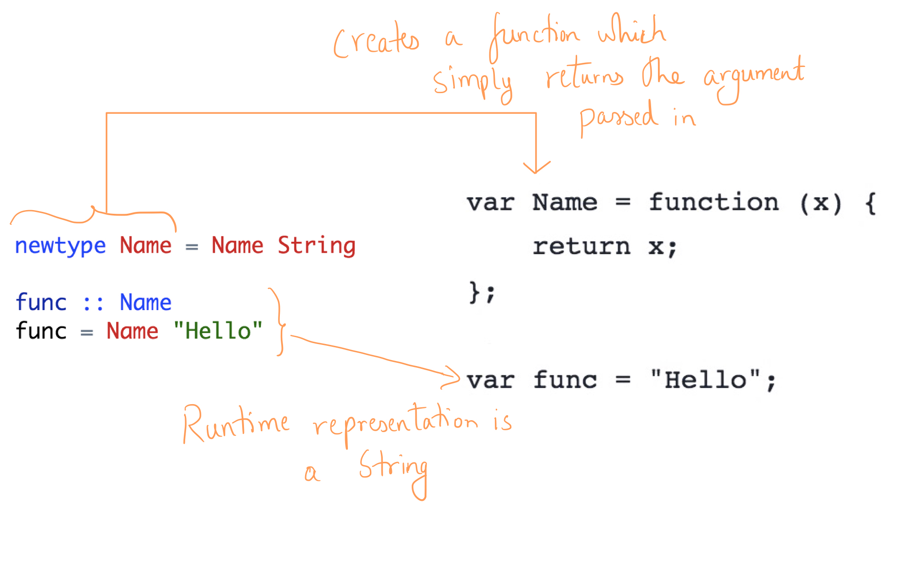

## Foreign Function Interface

### Calling PureScript code from JavaScript

### Using "pulp build" - CommonJS modules

1. Build the project into CommonJS module using "pulp build"
2. Import the module using "var moduleName = require('ModuleName')"
3. Your "moduleName" variable now contains all the functions inside the module "ModuleName".


### Using "pulp build -O --to file.js" - using global purescript namespace

1. Build the project into a JavaScript file using "pulp build -O --to file.js".
2. "PS" is a global variable containing all your modules.
3. In our case, let's say we want the module "ModuleName", we can access it using "PS.ModuleName". We could also simply assign it to a variable using "var moduleName = PS.ModuleName"
4. "moduleName" variable now contains all the functions inside the module "ModuleName".

### Name generation

Refer book

### Runtime Data Representation



In this section, we understand how PureScript types are represented in JavaScript.

Simple Types are translated to their JavaScript equivalent as shown below



BUT all of the corresponding JS values CANNOT be "undefined" or "null".



Arrays are converted to JavaScript arrays but all elements will be of same type in the converted JS array.

Records are represented as JavaScript Objects.



Functions of a single parameter are represented as functions of single parameter even in JavaScript.

Functions with more than one parameter are represented as a function within functions(curried functions)



#### ADT Representation
Let's see how ADTs will be represented in JavaScript. We use our familiar "Point" and "Shape" ADT that we've seen in the ADT chapter.

PureScript code
```
module Main where

import Prelude
import Control.Monad.Eff (Eff)
import Control.Monad.Eff.Console (CONSOLE, log)

data Shape = Circle Point Number
  | Rectangle Point Number Number
  | Line Point Point
  | Text Point String
  | GhostShape

data Point = Point { x :: Number, y :: Number}

createPoint :: Number -> Number -> Point
createPoint x y = Point {x, y}

exampleLine :: Shape
exampleLine = Line p1 p2
  where
    p1 :: Point
    p1 = Point { x: 0.0, y: 0.0 }

    p2 :: Point
    p2 = Point { x: 100.0, y: 50.0 }


anotherShape :: Shape
anotherShape = Circle (Point {x : 50.0, y : 50.0}) 100.0


main :: forall e. Eff (console :: CONSOLE | e) Unit
main = log "Hello sailor!"
```

JavaScript code for the above PureScript code
```
"use strict";
var Control_Monad_Eff = require("../Control.Monad.Eff");
var Control_Monad_Eff_Console = require("../Control.Monad.Eff.Console");
var Prelude = require("../Prelude");
var Point = (function () {
    function Point(value0) {
        this.value0 = value0;
    };
    Point.create = function (value0) {
        return new Point(value0);
    };
    return Point;
})();
var Circle = (function () {
    function Circle(value0, value1) {
        this.value0 = value0;
        this.value1 = value1;
    };
    Circle.create = function (value0) {
        return function (value1) {
            return new Circle(value0, value1);
        };
    };
    return Circle;
})();
var Rectangle = (function () {
    function Rectangle(value0, value1, value2) {
        this.value0 = value0;
        this.value1 = value1;
        this.value2 = value2;
    };
    Rectangle.create = function (value0) {
        return function (value1) {
            return function (value2) {
                return new Rectangle(value0, value1, value2);
            };
        };
    };
    return Rectangle;
})();
var Line = (function () {
    function Line(value0, value1) {
        this.value0 = value0;
        this.value1 = value1;
    };
    Line.create = function (value0) {
        return function (value1) {
            return new Line(value0, value1);
        };
    };
    return Line;
})();
var Text = (function () {
    function Text(value0, value1) {
        this.value0 = value0;
        this.value1 = value1;
    };
    Text.create = function (value0) {
        return function (value1) {
            return new Text(value0, value1);
        };
    };
    return Text;
})();
var GhostShape = (function () {
    function GhostShape() {

    };
    GhostShape.value = new GhostShape();
    return GhostShape;
})();
var main = Control_Monad_Eff_Console.log("Hello sailor!");
var exampleLine = (function () {
    var p2 = new Point({
        x: 100.0,
        y: 50.0
    });
    var p1 = new Point({
        x: 0.0,
        y: 0.0
    });
    return new Line(p1, p2);
})();
var createPoint = function (x) {
    return function (y) {
        return new Point({
            x: x,
            y: y
        });
    };
};
var anotherShape = new Circle(new Point({
    x: 50.0,
    y: 50.0
}), 100.0);
module.exports = {
    Point: Point,
    Circle: Circle,
    Rectangle: Rectangle,
    Line: Line,
    Text: Text,
    GhostShape: GhostShape,
    anotherShape: anotherShape,
    createPoint: createPoint,
    exampleLine: exampleLine,
    main: main
};
```

Each data constructor gets a variable of its own. Let's take the "Circle" data constructor for example.



* Firstly, a constructor which accepts the arguments of the data constructor gets created.
* Secondly, since Circle does have arguments, a "create" function gets created. This function can be used as a curried function to create a Circle data type. The parameters passed into the "create" function are the arguments of the "Circle" data constructor.

Side note : the returned "Circle" is the Constructor "Circle". But Circle also has an attribute, a function called "create". Can use it as "new Circle(val0, val1)" or as "Circle.create(val0)(val1)".

But if the data constructor doesn't have any arguments, as is the case with our "GhostShape" data constructor,



* In this case, an empty Constructor is created.
* A "value" attribute containing an instance of the "GhostShape" is created.


#### NewType Representation



* NewType simply creates a function which returns the argument passed in.
* NewTypes DONT exist at runtime. They are simply replaced by the type taken in by the data constructor (String in our case) at runtime.
