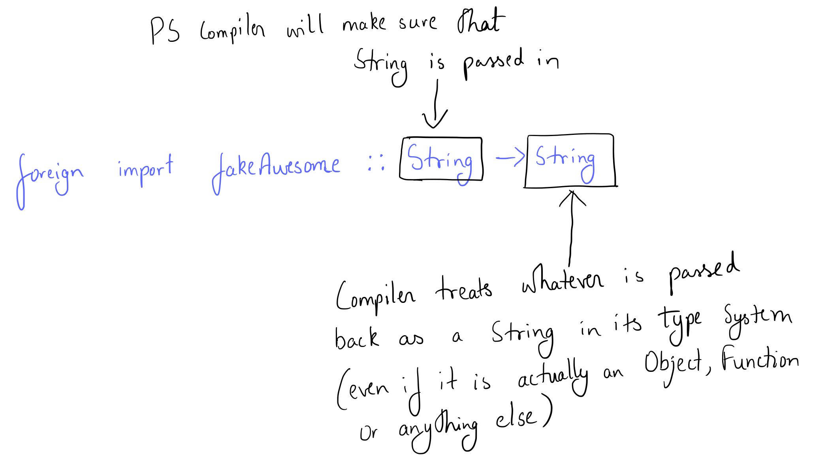
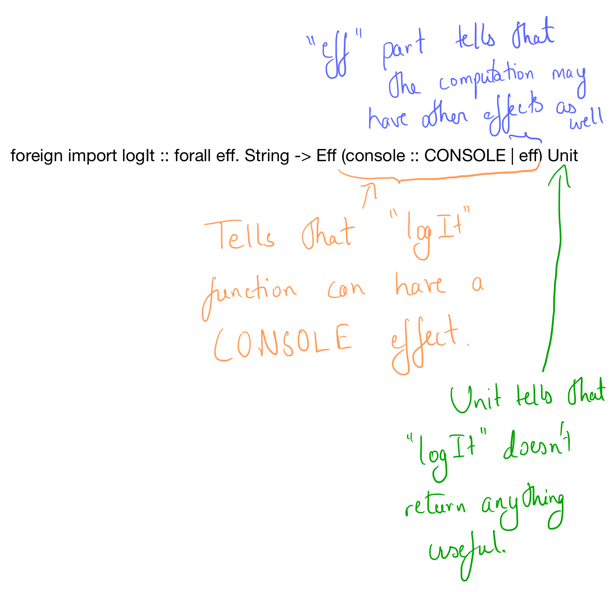

convenience## Foreign Function Interface Part 2

## Calling JavaScript code from PureScript

Let's say we have a file, say, "Main.purs" from which we want to call our JavaScript code from

* Create a file "Main.js" in the same folder (since we're calling the code from Main.purs, our js file name is Main.js, if it were SomethingElse.purs, we'd have SomethingElse.js).

* Write your JavaScript function in the Main.js. The first line of this Main.js should be "use strict;"

* Add all the functions you want to export as properties to the "exports" object

~~~javascript
"use strict";

function addAwesome(someStr){
  return someStr + " is awesome!";
}

exports.addAwesome = addAwesome;
~~~

* In Main.purs, import the foreign function (this is what we call our JavaScript function) using
~~~purescript
foreign import addAwesome :: String -> String
~~~

* We can now use our foreign "addAwesome" function in our PureScript code.

~~~purescript
main = log $ addAwesome "Gulab Jamoon"

-- prints "Gulab Jamoon is awesome" onto the console.
~~~


We can export pre existing functions from JS too. For example, the "encodeURIComponent" function.

In Main.js

~~~javascript
exports.encodeURIComponent = encodeURIComponent;
~~~

In Main.purs

~~~PureScript
foreign import encodeURIComponent :: String -> String

main = log $ encodeURIComponent "Gulab Jamoon"

-- prints "Gulab%20Jamoon"
~~~

### Getting deeper into what we mean when we say "foreign import addAwesome :: String -> String"

We might initially look at the above declaration and feel that "addAwesome" is a pure function which takes in a String and returns a String. Butttt.... well, it's not that straightforward.

What we actually mean by "foreign import addAwesome :: String -> String" is that PureScript will check the first parameter type and make sure that first parameter is of type String. The return type, compiler understands that it is expecting a String. And compiler will treat whatever is returned as a String in it's type system.

The compiler will not run any checks to make sure that the return type is actually something compatible with a PureScript String. For example, let's define another foreign function "fakeAwesome"


#### CASE 1:

In Main.js

~~~javascript
// Only if "someStr" variable is "gulab jamoon", add " is awesome!" to string. Else return the object {name : "Sleepy", age : 23}
function fakeAwesome(someStr){
  if(someStr.toLowerCase() == "gulab jamoon"){
    return someStr + " is awesome!";
  }else{
    return {name: "Sleepy", age:23}; // NOT a string
  }
}
~~~

In Main.purs

~~~PureScript
foreign import fakeAwesome :: String -> String

fakeAwesomeTest :: forall e. String -> Eff (console :: CONSOLE | e) Unit
fakeAwesomeTest st = log $ ( "fakeAwesome output : " <> (fakeAwesome st))

main = fakeAwesomeTest "Gulab Jamoon"

-- prints "fakeAwesome output : Gulab Jamoon is awesome!"
~~~

#### CASE 2:

But if, instead, we had a main function as shown below

~~~purescript
main = fakeAwesomeTest "Laddu"

-- prints "fakeAwesome output : [object Object]"
~~~

#### CASE 3:

If, instead, we had a main function and fakeAwesomeTest as
~~~purescript
fakeAwesomeTest :: forall e. String -> Eff (console :: CONSOLE | e) Unit
fakeAwesomeTest st = log $ fakeAwesome st

main = fakeAwesomeTest "Laddu"
-- directly logging.
-- prints "{name: 'Sleepy', age: 23}"
~~~

Case 1 is expected and normal. But what is happening in case 2 and case 3? And why do they differ so much? One might expect to see "[object Object]" printed in Case 3 since we removed the "fakeAwesome output : " string appending. But we see a completely different output. Also, why doesn't the code run into an exception? We are passing an Object where a string is expected. Shouldn't that raise an exception anywhere?

When we tell the compiler that the foreign function will return a String, what happens is that the compiler just lets whatever object you pass back be treated like a string.(even if its not a string)



Okayyy.... Compiler treats an object as a String..... and it seems to be working fineee! WHY ISN'T ANYTHING CRASHING?!

In CASE 2, our fakeAwesome function is calling "<>" and log
~~~PureScript
log $ ( "fakeAwesome output : " <> (fakeAwesome st))
~~~
<> is nothing but an alias for the "append" function in Semigroup type class

SemiGroup instance for String is defined as
```purescript
instance semigroupString :: Semigroup String where
  append = concatString

foreign import concatString :: String -> String -> String
```

"concatString"s JS code is
~~~javascript
exports.concatString = function (s1) {
  return function (s2) {
    return s1 + s2;
  };
};
~~~

We're appending two strings using the "+" string append operation in JavaScript. Let's try a simple experiment in JS.
~~~javascript
let a = {name : "Sleepy", age :23}
console.log( "hello " + a )
//prints "hello [object Object]" on the console.
~~~

Lets sum it all up - PureScript is just passing the object returned into whatever function we call. Since the object was passed to append function which in turn passed it to concatString foreign function, which then used it with the JavaScript string "+" operation, since all that happened, and since that "fakeAwesome output : " + obj would result in "fakeAwesome output : [object Object]" in JavaScript, we get the same output in PureScript.

BUT in case 3, we're passing the returned "String" (actually an object) into the log function directly.

log function is defined in PureScript as
~~~PureScript
foreign import log
  :: forall eff
   . String
  -> Eff (console :: CONSOLE | eff) Unit
~~~

Its definition in JS is
~~~javascript
exports.log = function (s) {
  return function () {
    console.log(s);
    return {};
  };
};
~~~

If we try the following in JS console
~~~javascript
let a = {name : "Sleepy", age :23}
console.log(a)

//prints "{name: 'Sleepy', age: 23}"
~~~

In Case 3, since we're passing the returned object directly into the foreign function log, foreign functon log just calls "console.log" and since console.log has the behaviour of printing out all the key value pairs of an object, we get "{name : 'Sleepy', age: 23}" printed out.

#### IMPORTANT INFERENCE
The compiler treats the returned object as a String and lets the object be passed into wherever a string is expected. The actual behaviour depends on the definition of the function and how the object is used in the function.

BUT still, why isn't anything crashing?! This.... this... it shouldn't work!

Okay, okay. let's make it crash

In Main.purs
~~~purescript
import Data.String (length)

fakeAwesomeCrash :: forall e. String -> Eff (console :: CONSOLE | e) Unit
fakeAwesomeCrash st = log $ show $ length (fakeAwesome st)
-- length function just returns the length of the string

main = fakeAwesomeCrash "Gulab Jamoon"

-- prints "24"
~~~

But length function is a foreign function defined in JS as
~~~javascript
exports.length = function (s) {
  return s.length;
};
~~~
Does an object have length attribute? Lets find out

If we change out main function in above example to

~~~purescript
main = fakeAwesomeCrash "Ladoo"
~~~

s.length will return "undefined" from length function. "undefined" will be treated as an Int and passed into the show instance of the Int.

~~~PureScript
instance showInt :: Show Int where
  show = showIntImpl

foreign import showIntImpl :: Int -> String
~~~

"showIntImpl" is defined as
~~~javascript
exports.showIntImpl = function (n) {
  return n.toString();
};
~~~

undefined.toString? Yep. We get our program to crash. Finally.

~~~
TypeError: Cannot read property 'toString' of undefined
~~~

Important lesson here - program behaviour gets unpredictable if you pass unexpected objects back. If you say you're going to return a String, return a String. Don't be a liar.

Side Note : PureScript primitive types cant have null or undefined assigned to them. Hence, when we say String is expected, what we actually mean is that we expect a JavaScript string which isn't null or undefined. Make sure those cases are handles as well.

### Using PureScript ADTs, newtypes in JavaScript

Review the concepts covered in the first part of the ForeignFunctionInterface course. To use the purescript data types in JavaScript, we need to understand how purescript types are represented in JavaScript(which is what we covered in Part1 of FFI)

## Foreign Data

Suppose we have a type in JS that can't be represented in PS. Some type that is only accessible in JavaScript. How can we work with such types in PureScript?

If we can't directly access the type in PS, we can still treat the type as an Abstract Data Type (not the purescript ADT, rather, the concept of an Abstract Data Type) which is defined by its functions(functions which can be exported to PS and used from PS).

Even if we're not allowed to modify the type in PS, we still need a way to reference the type in PS. This is where the "foreign import data" declaration can be used.

```
foreign import data Contacts :: Type
```
The above declaration is how we import a foreign data type into PureScript. We're telling the compiler to create a new type called "Contacts".

* "Contacts" is a type constructor.
* ":: Type" is used to represent the kind of the type.

(Contacts can be represented easily even in PureScript but for the purposes of learning, we need a simple example. Hence, we build a simple Contacts Abstract Data Type)


Let's say we have the following methods on the Contacts type

<strong>add :: Contacts -> String -> String -> Contacts</strong>

add adds a contact to the Contacts list. (second param is name, third is number) and returns a new Contacts list.

<strong>remove :: Contacts -> String -> Contacts</strong>

second param is the name of the contact.

<strong>update :: Contacts -> String -> String -> Contacts</strong>

second param is name. third param is new number.

<strong>createNewContacts :: Contacts</strong>

createNewContacts returns an empty Contacts type

Let's see how we could create such a type in JS and how we could work with it in PureScript.

In Main.js

~~~javascript

function createNewContacts(){
  return {}; // this Object is our Contacts type
}

function addToContacts(contacts){ // the same contacts Object will be passed here
  return function(name){ //  name of the contact. a String
    return function(number){ // number of the contact. a String
      contacts[name] = number;
      return Object.assign({}, contacts); //returning a new copy
    }
  }
}

function removeFromContacts(contacts){// the same Object will be passed here as well
  return function(name){ // name is a string. the name of the contact
    delete contacts[name];
    return Object.assign({}, contacts);
  }
}

function updateContacts(contacts){//the same contacts Object will be passed here as well
  return function(name){ // name is a String
    return function(number){ // number is also a String. the new value of number
      contacts[name] = number;
      return Object.assign({}, contacts);
    }
  }
}


function contactsStr(contacts){// contacts is an Object.
  return JSON.stringify(contacts);//return a Sting representing the Object
}

exports.createNewContacts = createNewContacts;
exports.addToContacts = addToContacts;
exports.removeFromContacts = removeFromContacts;
exports.updateContacts = updateContacts;
exports.contactsStr = contactsStr;
~~~

We can now import these functions into ps and use them.

~~~purescript
foreign import data Contacts :: Type
foreign import createNewContacts :: Contacts
foreign import addToContacts :: Contacts -> String -> String -> Contacts
foreign import updateContacts :: Contacts -> String -> String -> Contacts
foreign import removeFromContacts :: Contacts -> String -> Contacts
foreign import contactsStr :: Contacts -> String

-- addTest tests the addToContacts function
-- adds  ("Prasanna" , "1234"), ("Person2", "5678") to the Contacts object
addTest :: Contacts
addTest = addToContacts (addToContacts (createNewContacts) "Prasanna" "1234") "Person2" "5678"

-- updateTest tests the "updateContacts" function
-- updateTest uses the Contacts object generated by addTest and updates "Prasanna" from "1234" to "9876"
updateTest :: Contacts
updateTest = updateContacts addTest "Prasanna" "9876"

-- removeTest removes the "Prasanna" entry from the Contacts
removeTest :: Contacts
removeTest = removeFromContacts addTest "Prasanna"

-- logs the result of whatever test we decide to run
contactsTest :: forall e. Eff (console :: CONSOLE | e) Unit
contactsTest = log $ contactsStr $ removeTest
~~~


## Side Effects

We've entered the realm of JS. Where side effects roam unchecked and freely. Let's now learn how to import foreign functions which can cause such side effects.

#### Kind Effect

We have previously seen the kind called "Type" which is the kind of all types that we have encountered so far.

We will now have a look at a new kind called Effect. Effect is the kind of all effects.

Example :

~~~purescript
-- | The `CONSOLE` effect represents those computations which write to the
-- | console.
foreign import data CONSOLE :: Effect

-- the above line declares a new data of kind Effect called "CONSOLE". CONSOLE is used to represent the console side effects.

-- | The `RANDOM` effect indicates that an Eff action may access or modify the
-- | JavaScript global random number generator, i.e. `Math.random()`.
foreign import data RANDOM :: Effect
~~~

## Eff Monad

Eff Monad provides an API to represent side effects

Read section 8.10

#### Rows and Objects

Read section 8.14

~~~
> :kind Eff
# Control.Monad.Eff.Effect -> Type -> Type
~~~

Eff takes a row of types of kind Control.Monad.Eff.Effect  as the first type parameter, which represents the list of Effects that are allowed to occur in the computation represented by that Eff Monad.

Second parameter is of kind Type. This second parameter represents the return type.

Let's create our own "logIt" function which takes a string and logs it onto the console.

In Main.js
~~~javascript
function logIt (logStr){
  console.log(logStr);
}

exports.logIt = logIt;
~~~

In Main.purs

~~~purescript
foreign import logIt :: forall eff. String -> Eff (console :: CONSOLE | eff) Unit

main = logIt "Hello, Navigator"

-- prints "Hello, Navigator" to the console.
~~~



### Will it cause our code to crash if we use side effects without mentioning it in Eff?

Well, turns out that mentioning the effects is optional. But highly recommended. The row of effects is for our convenience. We can literally do anything inside any foreign JS function. Even if we haven't specified the Eff type.

BUT if we don't specify the Eff type in a function, purescript compiler assumes that the function is pure. This might cause it to not calculate the result everytime the function is called. If the result for a value is already known, the result might be directly returned. By specifying Eff, we tell the compiler to calculate the result every single time the function is called.
