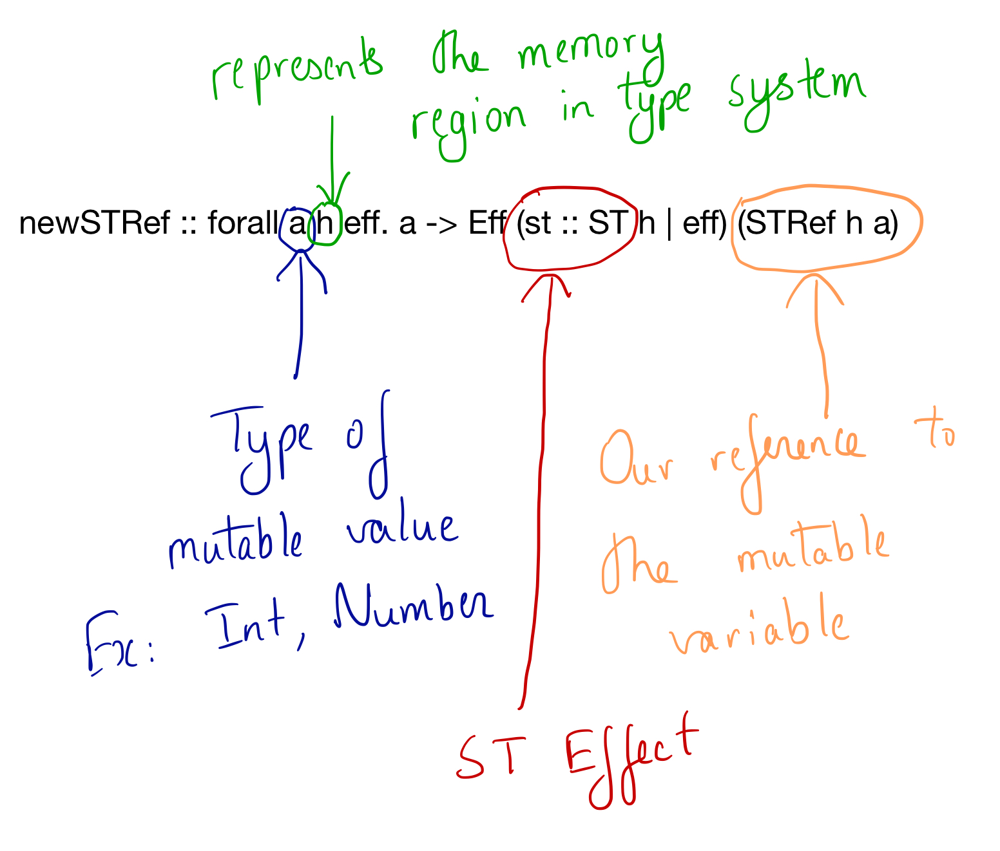
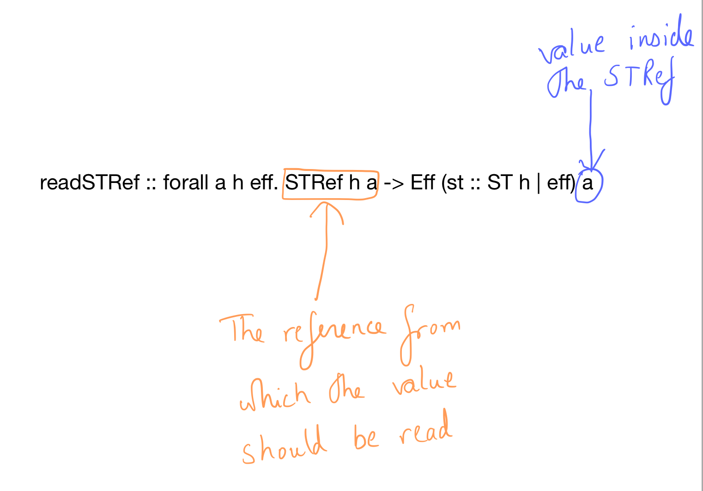
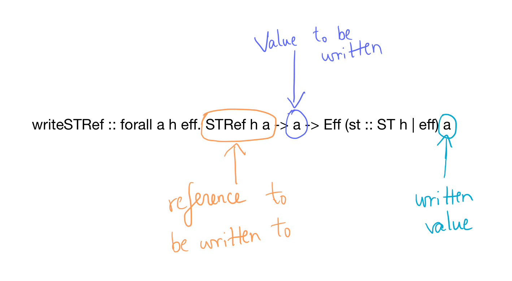
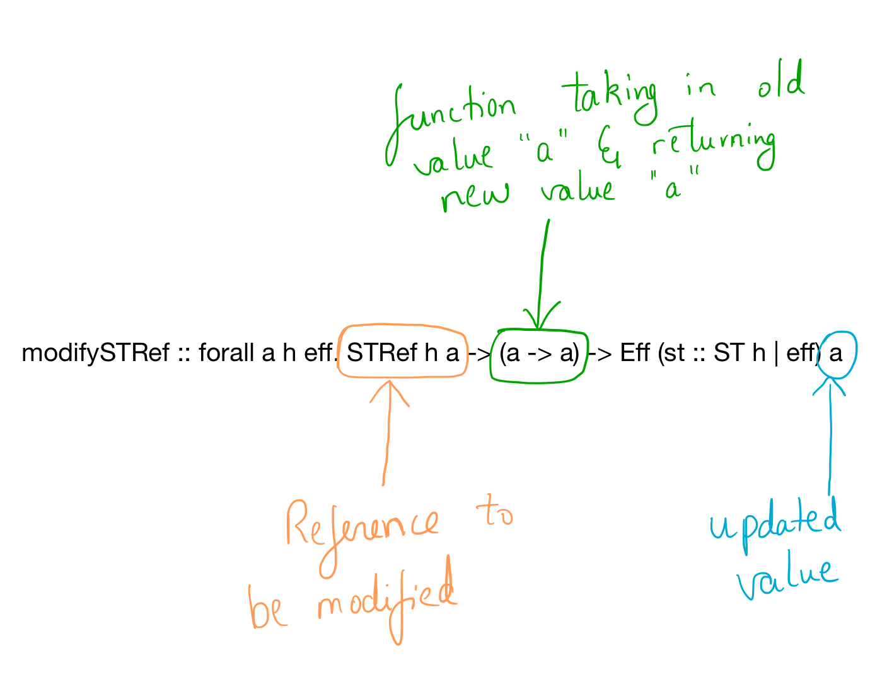

## ST Monad

In PureScript, we can't modify the values assigned to variables once they're assigned.

~~~purescript
a = 1
a = a + 1 -- NOT ALLOWED
~~~

The ST Monad (Control.Monad.ST module) is used to fix this issue and allow locally mutable variables.

These are the functions that we'll need in order to work with ST Monads

#### To create a new mutable state

We use the "newSTRef" function to create a new reference to a mutable variable
~~~purescript
newSTRef :: forall a h eff. a -> Eff (st :: ST h | eff) (STRef h a)
~~~

We can use the returned "STRef h a" to reference the data that we want to mutate.

~~~purescript
calc = do
  ref <- newSTRef 0 -- creates new reference of type Int
~~~

#### Reading the value from STRef

We can use the readSTRef function to read the values inside the STRef by specifying the reference.

~~~purescript
readSTRef :: forall a h eff. STRef h a -> Eff (st :: ST h | eff) a
~~~

Example :
~~~PureScript
calc = do
  ref <- newSTRef 0 -- creates new reference of type Int
  val <- readSTRef ref -- val now contains int 0
~~~

#### Writing a value into an STRef

We can write a value into STRef using "writeSTRef" function. The first parameter is the STRef to be modified. Second parameter is the new value.

~~~purescript
writeSTRef :: forall a h eff. STRef h a -> a -> Eff (st :: ST h | eff) a
~~~

#### Modifying a value inside the STRef using a function

We can use modifySTRef to modify a value inside the STRef using a function. First parameter is a reference to the STRef. Second parameter is a function which takes in the value a, runs a computation on it and returns the value a.

~~~purescript
modifySTRef :: forall a h eff. STRef h a -> (a -> a) -> Eff (st :: ST h | eff) a
~~~

#### A simple (yet, useless) example

~~~purescript

fu = do
  ref <- newSTRef 0  -- create a new STRef
  _ <- modifySTRef ref (\ref -> ref + 10)  -- modify the STRef to take the current value and add 10 to it
  curVal <- readSTRef ref -- read from the STRef, its current value i.e 10
  writeSTRef ref (curVal + 10) -- write 20 to "ref"
~~~
